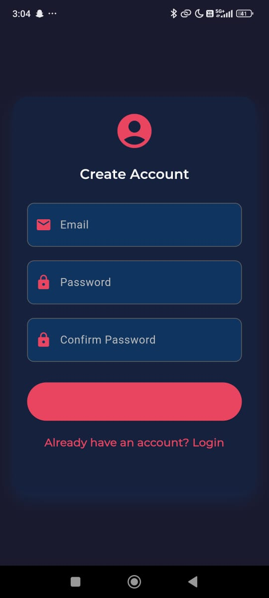

# Redact

Bad me bataunga kya hai redact

## Features

- Secure user authentication
- File upload and management
- baki bad me

## Getting Started

abhi bana nahi hai 

### Prerequisites

- Laptop
- Baki khud se pata karo


### Installation

1. Clone the repository:
   ```
   git clone https://github.com/Pranav322/redact.git
   ```

2. Navigate to the project directory:
   ```
   cd redact
   ```

3. Install dependencies:
   ```
   flutter pub get
   ```

4. Run the app:
   ```
   flutter run
   ```

## Project Structure

- `lib/`: Contains the main Dart code for the application
  - `main.dart`: Entry point of the application
  - `main_screen.dart`: second entry point , decides the navigation and responsible to bottomnavbar
  - `pages/`: Individual pages of the app
  - `screens/`: screens
  - `auth/` : login and register page sits here

## Contributing

banne toh do 

## License

no license you can steal it

## Acknowledgments

- kisi ko nahi karunga

## Screenshots

<p float="left">
  

   
  
  
  
  
</p>
